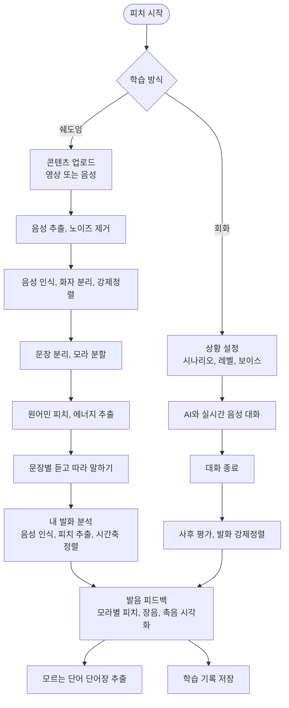
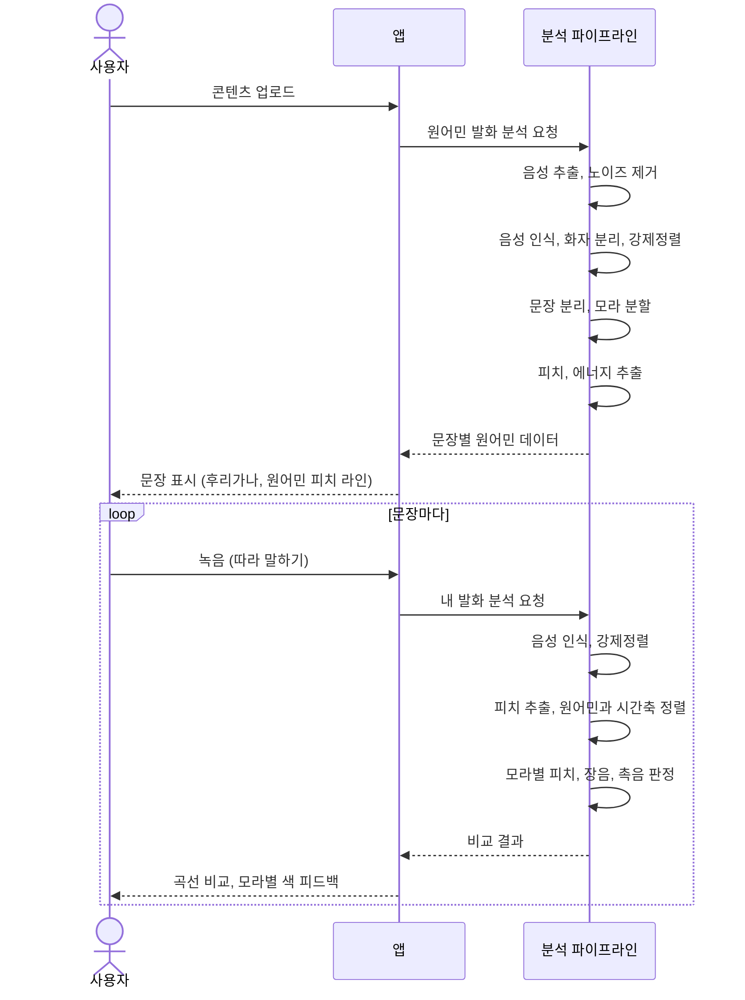
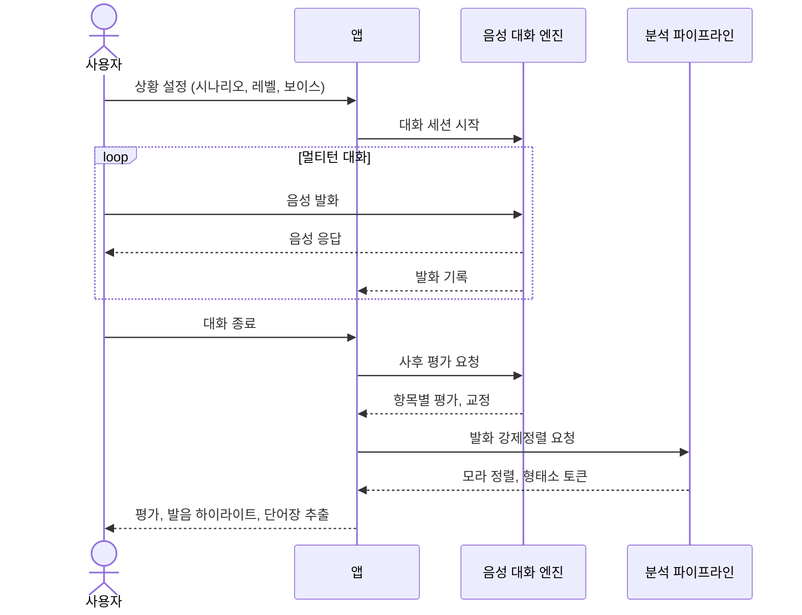
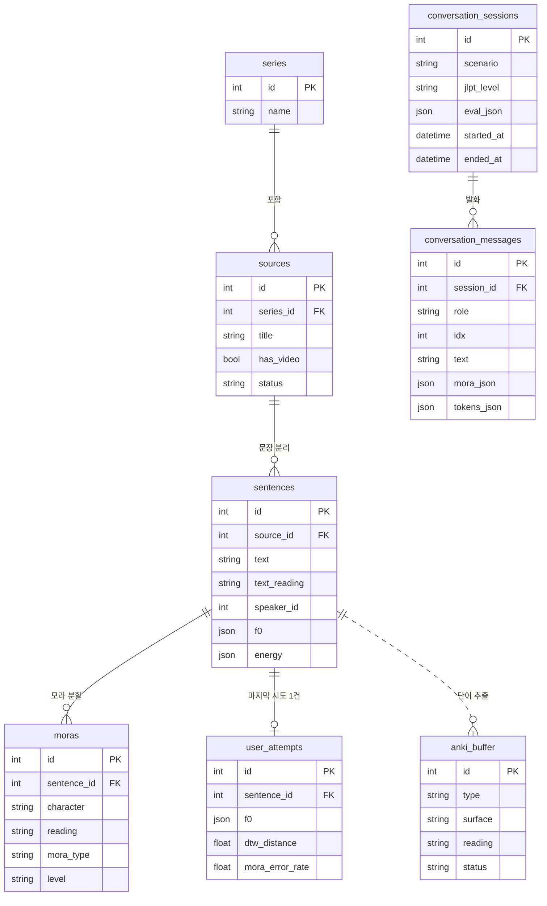

  
<h2>피치</h2>

피치와 함께 일본어 스피치

> [!NOTE]
> 일본어를 배우는 이유는 대개 시험이 아니라 직접 듣고 말하기 위해서다. 그러나 대부분의 학습 도구는 한자와 문법, 자격증 대비에 맞춰져 있고 자격증조차 말하기는 평가하지 않는다. 독학하는 사람에게는 일본어로 말을 붙여볼 상대마저 없으며, 말하기를 연습시켜 주는 AI 대화 앱도 일본어에서 의미를 가르는 피치(인토네이션)가 원어민과 얼마나 다른지는 짚어 주지 못한다.
>
> **피치**는 이러한 문제를 해결한다. 언제든 부담 없이 나눌 수 있는 AI 음성 회화, 그리고 좋아하는 영상이나 음성을 가져와 문장 단위로 따라 말하는 쉐도잉이다. 어느 쪽이든 사용자의 발화를 원어민의 F0 곡선과 모라 단위로 포개어, 어느 음에서 어떻게 벌어졌는지를 색으로 드러낸다.
>
> 그 결과 학습자는 점수가 아니라 실제로 통하는 발음에 집중하게 되고, 말할 상대가 없다는 벽과 내 발음이 맞는지 모른다는 벽을 한꺼번에 허문다. 틀려도 괜찮은 상대와 충분히 연습하고 자기 발음이 어디까지 닿았는지 눈으로 확인하면서, **학습자는 원어민에 가까운 어휘 사용과 억양으로 다가설 수 있다.**

  

## Pain Point

#### 목적에 맞는 학습 방법의 부재

- 일본어 학습자가 꼽는 학습 목적의 상위는 콘텐츠 향유, 여행, 취업처럼 직접 듣고 말하는 상황
- 그러나 시중의 학습 도구 대부분은 한자, 문법, 자격증 대비에 맞춰져 있음
- JLPT를 비롯한 자격증은 문법, 어휘, 독해, 청해만 평가할 뿐 말하기는 측정하지 않음
- 최고 등급인 N1을 따고도 막상 원어민과 대화가 통하지 않는 격차가 반복됨

#### 말하기 연습 상대의 부재

- 혼자 공부하는 학습자에게는 일본어로 말을 붙여 볼 상대 자체가 없음
- 원어민이나 교사와 회화를 연습할 기회를 충분히 갖기 어려움
- 사람과의 대화는 틀릴까 봐 입을 떼지 못하는 말하기 불안을 동반해, 연습량 자체가 줄어듦

#### 발음, 인토네이션 피드백의 부재

- AI 음성 대화 앱이 늘었지만, 피드백은 문법, 어휘, 유창성 수준에 머묾
- 일본어에서 의미를 가르는 피치(인토네이션)가 원어민과 어떻게 다른지는 추출해 비교하지 않음
- 발음 점수 앱도 몇 점인지 결과만 줄 뿐, 어느 모라에서 어떻게 어긋났는지는 보여주지 못함

  

## Solution

#### 실시간 AI 음성 회화

자신의 실력 때문에 실제 사람과 말하기가 불안한 사람도, 언제든 원하는 상황을 골라 연습할 수 있음

- 시나리오 프리셋이나 직접 설정한 상황으로 롤플레잉
- 장소, 역할, 목적, 성공기준을 정해 목표가 있는 과제형 대화
- JLPT 레벨(N5~N1)에 맞춰 에이전트 발화 속도와 난도 자동 조절
- 보이스와 간사이 사투리 세기 선택, 내 자료(기사 등)를 붙여넣어 그 소재로 대화
- 대화가 끝나면 항목별 성공, 실패 판정과 교정 문장을 받고, 내 발화를 말풍선에서 다시 들으며 글자 단위로 확인

> [!TIP]
> 병원 접수 상황을 고르면 접수 직원 역할의 AI가 「本日はどうされましたか？」라며 먼저 말을 걸고, 증상 설명부터 접수까지 실제처럼 주고받는다

#### 내 콘텐츠 쉐도잉

정해진 교재 문장이 아니라 내가 좋아하는 바로 그 장면으로 연습

- 좋아하는 드라마나 인터뷰 영상, 음성을 올리면 문장 단위로 분리되어 분석됨
- 한 문장씩 후리가나와 원어민 피치 라인을 보며 듣고 따라 말하기
- 원어민의 인토네이션과 발음은 물론 말투까지 따라 하며 네이티브에 가까워질 수 있음

> [!TIP]
> 좋아하는 일본 드라마 한 장면을 올리면 대사가 문장별로 쪼개지고, 각 문장의 원어민 억양을 보며 그대로 따라 말할 수 있다

#### 원어민 F0 곡선 비교

점수가 아니라 어느 모라에서 어떻게 어긋났는지를 눈으로 보여줌

- 원어민 F0와 내 F0를 시간축 정렬(DTW)해 겹친 곡선으로 시각화
- 모라 단위로 피치가 어긋난 지점, 장음(長音), 촉음(促音) 오류를 색으로 짚어줌
- 단어 사전식 표기가 아니라 accent phrase, downstep이 반영된 문장 속 실제 곡선

> [!TIP]
> 젓가락 はし를 다리 はし의 억양으로 발음하면 해당 모라가 빨갛게 표시되고, 원어민 곡선과 내 곡선이 어디서 벌어졌는지 한눈에 보인다

#### 발화 단어 단어장 추출

대화나 쉐도잉 중 모르는 단어를 그 자리에서 단어장에 담아 Anki로 복습

- 대화 말풍선이나 학습 문장을 형태소 단위로 골라 단어장에 추가
- 탭(단어)이나 드래그(구)로 선택하고 한자별 읽기까지 함께 저장
- 단어를 따로 찾아 옮겨 적을 필요 없이 한 앱에서 학습과 복습이 이어짐

> [!TIP]
> 회화 중 상대가 쓴 予約라는 단어를 몰랐다면, 말풍선에서 그 단어를 탭해 읽기를 확인하고 바로 Anki 덱에 넣을 수 있다

  

## 결과물

| 홈화면 |
| --- |
|  |

| 영상 추가 |
| --- |
||

| 학습화면 | 피드백 |
| --- | --- | 
|  | |

| 추출모드 | anki 연동 | 
| --- | --- |
|  |   | 

| 대화 주제 | 목소리 사투리 설정 |
| --- | --- |
|  |  |

| 실시간 대화 | 피드백 |
| --- | --- |
|  |  | 

## 기술 스택

#### Frontend

- Tauri 2 (Rust 셸 + WKWebView)
- React + TypeScript
- TanStack Router, TanStack Query, Zustand
- Tailwind CSS, Base UI, lucide-react
- i18next / react-i18next
- Vite, Vitest

#### Backend & AI

- Rust 코어 (Tauri commands, sqlx + SQLite, specta 타입 바인딩)
- Python 사이드카 (음성/피치 분석, 형태소 분석, forced alignment)
- ElevenLabs Agents (멀티턴 음성 회화)
- DeepL (번역)

#### Infra & DevOps

- GitHub Actions (ci.yml, project-status.yml) — CI/CD
- Gemini (코드 리뷰)
- GitHub Issues + Projects (태스크 관리, GitHub Flow)
- SQLite + sqlx 마이그레이션 (로컬 데이터, 클라우드 DB 없음)
- Anki .apkg export (단어장 내보내기)

## 아키텍처

#### 플로우차트

쉐도잉과 회화 두 경로는 같은 발음 피드백으로 수렴한 뒤, 단어장과 학습 기록으로 이어진다.

#### 시퀀스 다이어그램

**쉐도잉** — 원어민 발화를 분석해 두고, 사용자가 따라 말할 때마다 비교한다.

**회화** — AI와 실시간으로 대화한 뒤, 종료 시점에 평가와 발음 분석을 한 번에 받는다.

#### ERD

쉐도잉 데이터(시리즈 → 소스 → 문장 → 모라)와 회화 데이터(세션 → 발화)가 나뉘어 있고, 두 경로에서 뽑은 단어가 단어장 버퍼로 모인다.

> [!NOTE]
> 회화에서 추출한 단어는 발화 텍스트에서 바로 담기므로 문장, 소스와 연결되지 않고 단어장 버퍼에 단독으로 저장된다.
